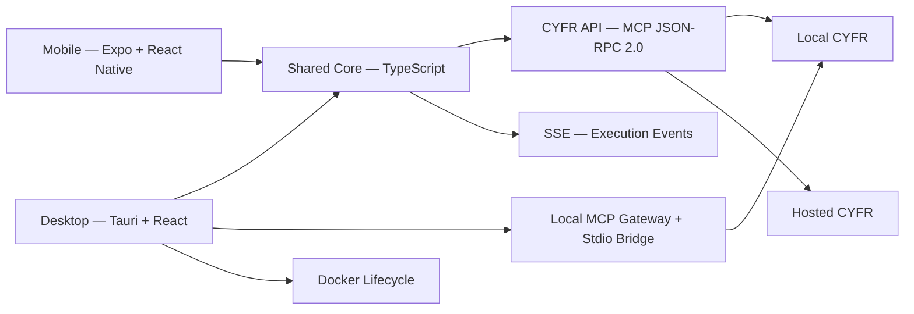

# Porta Plan

## Goal

Design `Porta` as a desktop-first client for CYFR that can connect to:

- a local CYFR instance running on the user's machine
- a hosted CYFR instance running remotely

Porta should also have a companion mobile surface, but the primary product should be the desktop experience.

## Product Positioning

Porta is not an admin dashboard and not a thin wrapper around server internals.

It is the main end-user client for interacting with CYFR:

- on desktop for rich, primary workflows
- on mobile for notifications, approvals, and lightweight control

The product should be designed around user goals and tasks, not around infrastructure concepts.

## Stack

### Desktop

- `Tauri`
- `React`
- `TypeScript`

Why:

- best fit for a desktop-centric product
- strong native integration for filesystem, tray, notifications, deep links, and local process helpers
- efficient packaging and distribution
- Rust backend handles MCP gateway, Docker lifecycle, system tray, and updates

### Mobile (future)

- `React Native`
- `Expo`

Why:

- strong mobile developer experience
- keeps the product in the same general frontend family
- good for approval flows, notifications, task status, and lightweight interaction

### Shared Core

- `TypeScript` packages

Why:

- API client, state management, hooks, and utilities are written in framework-agnostic TypeScript
- desktop keeps these in `src-ui/src/{api,hooks,state,lib}/`
- when mobile is added, these extract to a `packages/porta-core/` consumed by both

## Important Clarification

Porta should aim for a mostly unified product across desktop and mobile.

The default assumption should be:

- same core product model
- same information architecture where practical
- same terminology and mental model
- same core tasks and flows

The platform split should be kept narrow and intentional.

What should be shared:

- API client (MCP JSON-RPC 2.0 over HTTP)
- auth and session logic
- agent conversation state machine
- conversation compaction
- domain models and types
- design tokens

What will usually stay platform-specific:

- system integration (Docker lifecycle, system tray — desktop only)
- windowing and tray behavior
- local device permissions
- UI components (React DOM vs React Native primitives)
- navigation layout (sidebar vs bottom tabs)

## Product Shape

Porta should be one product with two clients:

- desktop client (primary)
- mobile client (companion)

Both should expose nearly the same core experience:

- connect to a CYFR instance
- interact with CYFR agents (ask questions, submit tasks)
- browse conversation history and activity
- manage integrations
- review permissions and trust decisions
- access settings and account state

The main functional difference should be desktop-local capability.

### Desktop

Desktop should expose everything the shared Porta product exposes, plus:

- local machine workflows
- file and folder operations tied to the local device
- local connector setup
- local MCP gateway support (aggregating stdio and HTTP tool providers)
- stdio-backed provider support
- Docker lifecycle management for local CYFR instances

This desktop-only layer is important because stdio providers and similar local bridges should not run on hosted infrastructure by default.

### Mobile

Mobile should track the same main product model, but with UI adapted to smaller screens.

It can still expose most of the same flows, while leaving out or simplifying:

- large-screen operational views
- heavy configuration workflows
- desktop-only local gateway actions
- Docker management

## Core Experience: Agent Conversation

The primary UX surface is the agent conversation — modeled after Prism's `agent_live.ex` but running as a standalone client that communicates with CYFR over HTTP.

### How It Works

1. User submits a message (with optional attachments)
2. Porta calls CYFR's MCP endpoint: `POST /mcp` with `tools/call` → `execution` tool, `run_stream` action
3. CYFR returns an `execution_id` and `stream_url`
4. Porta connects to SSE stream: `GET /api/executions/{id}/events`
5. Events stream back in real time:
   - `text_delta` — incremental text chunks (rendered as streaming markdown)
   - `tool_use` — tool being invoked (shown as activity card)
   - `tool_result` — tool completed (preview text)
   - `usage` — token counts
   - `conversation_complete` — canonical conversation history for next turn
   - `complete` — execution finished
   - `error` — execution failed

### Session Management

- MCP session via `MCP-Session-Id` header
- Auto-recovery on session expiry (HTTP 404 or error codes -33302/-33301)
- Mirrors the pattern established by Codex (`apps/codex/internal/mcp/client.go`)

### Conversation Persistence

- Conversations stored via CYFR's `storage` tool at `data/agent_conversations/{id}.json`
- Same storage path as Prism — conversations are visible from both clients
- Auto-save after each agent response completes

## UX Principles

Porta should feel like a client for getting work done, not a technical dashboard.

Core principles:

- lead with tasks, not infrastructure
- hide server internals by default
- use progressive disclosure for advanced details
- make permissions and trust boundaries explicit
- present actions in human-readable language
- provide clear progress, cancellation, retry, and recovery

## Information Architecture

### Desktop Navigation (sidebar)

- Home
- Ask (agent conversation — primary)
- Tasks
- Activity
- Integrations
- Settings
- Files (desktop only)
- Local Providers (desktop only)

### Mobile Navigation (bottom tabs)

Compressed into fewer tabs, preserving the same labels and concepts where possible.

## High-Level Architecture



## Repo Shape

### Current (Phase 2 — desktop build)

```text
apps/
  porta/                    # Desktop (Tauri + React + TypeScript)
    src/                    # Rust backend
    src-ui/                 # React + TypeScript frontend
      src/
        api/                # MCP client, SSE client, session (extractable)
        hooks/              # React hooks (extractable)
        state/              # Zustand stores (extractable)
        lib/                # Pure utilities (extractable)
        components/         # UI components
        styles/             # Tailwind + design tokens
```

### Future (when mobile is added)

```text
apps/
  porta/                    # Desktop (Tauri)
  porta-mobile/             # Mobile (Expo)

packages/
  porta-core/               # Extracted from src-ui: API, state, hooks, lib
  porta-design/             # Shared design tokens
```

Suggested responsibilities:

- `porta`: Tauri shell, React desktop UI, local MCP gateway bridge, Docker lifecycle
- `porta-mobile`: Expo mobile client
- `porta-core`: API client, agent state machine, conversation compaction, types
- `porta-design`: design tokens and shared styling primitives

## Delivery Phases

### Phase 1: Desktop Foundation

Build the desktop client as a standalone React + TypeScript app inside Tauri.

Deliverables:

- Vite + React + TypeScript + Tailwind scaffolding in Tauri
- Boot screen (Docker check, CLI check, container start, health check)
- MCP client (JSON-RPC 2.0, session management, auto-recovery)
- SSE client for execution event streaming
- Agent conversation UI (submit, stream, tool activity, markdown rendering)
- Model/provider selection
- Conversation persistence and history
- Navigation shell (Home, Ask, Tasks, Activity, Settings)
- MCP server configuration UI

### Phase 2: Desktop Polish

Deliverables:

- Keyboard shortcuts
- Custom titlebar for frameless window
- Update notification banners
- System tray integration
- File attachment support
- Tasks and Activity views (beyond stubs)

### Phase 3: Mobile Client

Deliverables:

- Extract shared code to `packages/porta-core/`
- Expo mobile app consuming porta-core
- Mobile-adapted agent conversation UI
- Bottom tab navigation
- Approvals and notifications
- Task control and monitoring
- Account and session support

## Recommendation Summary

The recommended technology choice is:

- desktop: `Tauri + React + TypeScript`
- mobile: `React Native + Expo` (future)
- shared core: `TypeScript packages`

This gives Porta the best balance of:

- strong desktop UX with native integration
- practical mobile support when needed
- high cross-platform product consistency via shared TypeScript core
- one desktop-only trust boundary for local MCP gateway and stdio-backed integrations
- architecture that supports mobile extraction without upfront complexity
